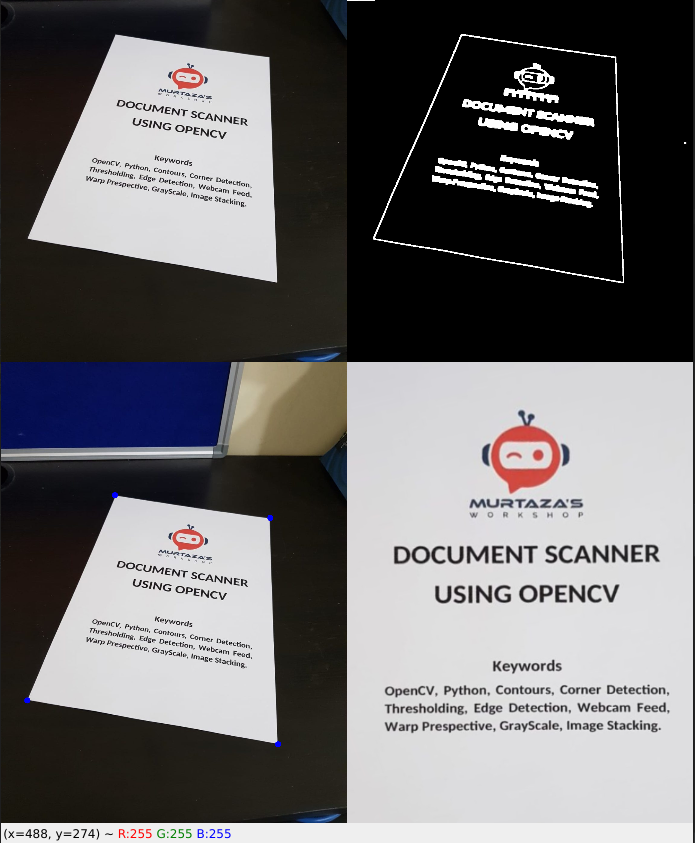
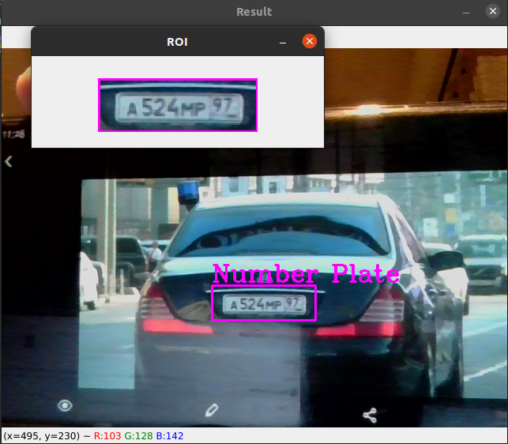
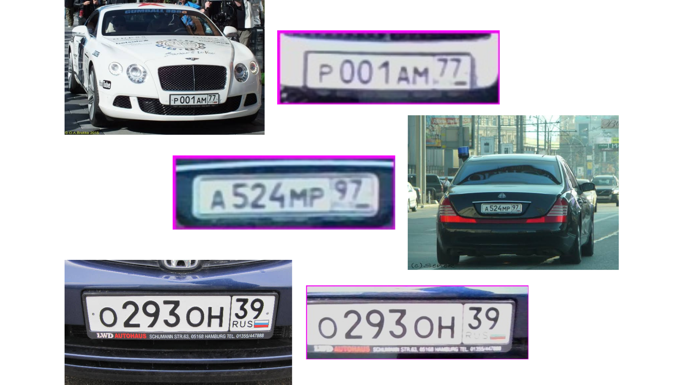

# OpenCV-Computer-Vision-Basics
This repo consists of some basics of OpenCV & Computer Vision. Also, there are 3 projects in this repo, namely 
- Virtual Paint
- Document Scanner
- Number Plate Detector 

## Overview of Chapters
- **Chapter 1** - Importing an image, a video, or to get live feed using a Webcam with the help of OpenCV Library
- **Chapter 2** - Applying various image transformations such as *Chaning Color Schemes* (RGB to Gray, etc), *Blur* (Gaussian Blur), *Egde Detection*, *Thickening and Thinning of Edfes*
- **Chapter 3** - Resizing and Cropping Images
- **Chapter 4** - Drawing Shapes such as *Circles*, *Rectangles*, *Lines*, etc on Images, and putting text on Images
- **Chapter 5** - Selecting a particular part of an image, & displaying it, after transforming it's Perspective.
- **Chapter 6** - Stacking several images together in a single Window
- **Chapter 7** - Obtaining masks out of an Image, by selecting ranges for Hue, Saturation & Brightness
- **Chapter 8** - Classification of Shapes on the basis of Edge Detection & Contours
- **Chapter 9** - Face Detection using **Haar Cascades**

## Project 1 | Virtual Paint 🖌️
- In this project, with the help of what we learnt in **Chapter 7**, we are detecting the masks of 3 different colors, namely Green, Orange & Purple.
- We are varying the min & max values of **Hue**, **Saturation** & **Brightness**, to perform the above task.
- If we are detecting any color in a given frame, then we are finding it's **Contours**, and calculating the area of that Contour.
- If the area is bigger than the Minimum Area (500) in this case, then we are storing the **Middle, Top-point Coordinates** of the Contour in an array, along with an **Index** to represent the color.
- And finally, we are iterating over the array, and plotting a point with the respective color, on the frame. 
- A Live Demo of this project, can be checked out on [Youtube](https://youtu.be/1dsXc7whpfw) 

 

## Project 2 |  Document Scanner 🖨️
- In this project, we are trying to detect documents in the frame, and are trying to select it from the entire frame, similar to what we did in **Chapter 5**.
- The first step is the **Pre-Processing** of the image, which includes conversion to Gray Color, using a Gaussian Blur, Edge-detection, and then Dilation & Erosion of the edges.
- We have done Dilation & Erosion, to increase the stability & reliability of detection.
- After that, we are trying to get the **Contours** of the different objects present in the frame, and finding out the object with the Biggest Contour in the frame, which we are assuming as our **Document**.
- And then we are just transforming the **Perspective** of that object, to select it from the entire frame, and display it separately. 
- The code can work on both Live Feed as well as Static Images, with slight modifications (Mentioned in the code itself). You can see an example of it below 👇

 

  

 

## Project 3 | Number Plate Detector
- In this project, we are detecting a Number Plate out of a Static Image or Live Feed, using **Haar Cascades**, similar to what we learnt in **Chapter 9**.
- If we want to, we can also save the detected Number Plate, in an Image Format.
- You can see it working & some examples of it below 👇

 

  

 
 

  

